## Laporan Praktikum - Soal 1

## Hasil dari Praktikum
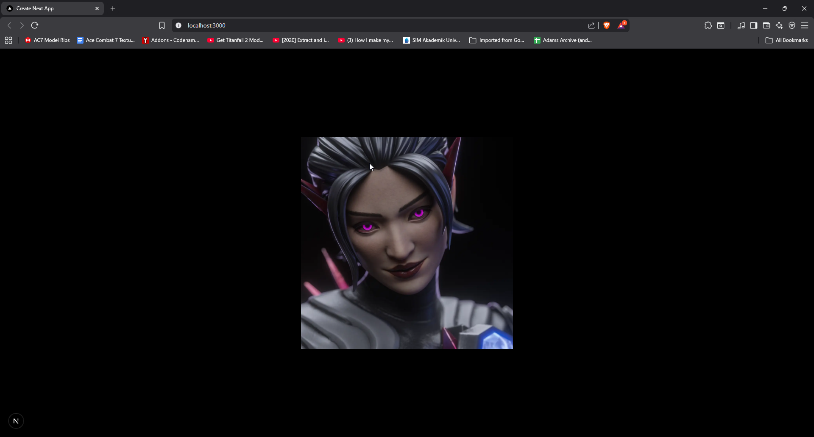

## Pelajaran
1. Komponen React/Next.js, memahami cara memisahkan logic UI ke dalam komponen terpisah ('Profile.tsx') agar mudah untuk dikelola dan rapi
2. Belajar konfigurasi 'tsconfig.json' menggunakan simbol '@' untuk mempermudah pemanggilan file tanpa harus menambahkan path yang panjang

## Error yang ditemukan dan solusi
1. Error pertama yaitu 'Error: Cannot find module '@/'**:
- Di sini penyebabnya pada 'tsconfig.json' belum mengarah ke folder 'src'
- Solusinya yaitu mengubah pada '"@/*": ["./src/*"]' pada bagian 'paths'
2. Kemudian selanjutnya error yang ditemukan adalah 'Error: ENOENT (package.json not found)'
- Yang menyebabkan yaitu terminal berada di luar folder utama, contohnya ketika ingin melakukan npm run dev seharusnya di folder proyek, misal my-app, jadi jalakan di dalam folder my-app
- Solusi yang sederhana sering kali lupa, yaitu melakukan perintah 'cd' + nama folder proyek yang berisi 'package.json'
3. Error yang ditemukan juga yaitu 'Error: Invalid src prop (hostname not configured)'
- Penyebabnya adalah menggunakan domain 'imgur.com' dan domain tersebut belum dikonfigurasi Next.js
- Solusinya adalah yaitu menambahkan 'remotePattern' di dalam 'next-config-ts' untuk konfigurasi

## Laporan Praktikum - Soal 2

## Hasil dari Praktikum
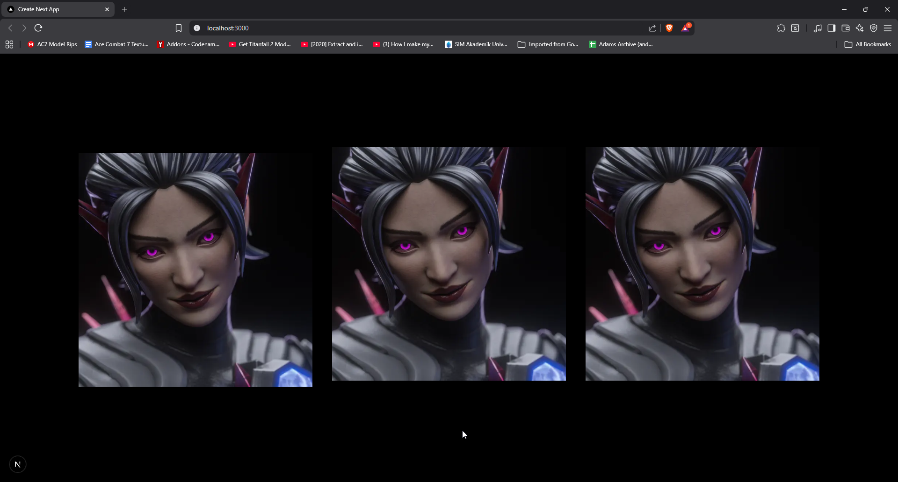

## Pelajaran
Dalam soal nomor 2 ini mempelajari 3 konsep fundamental dalam pengembangan React dan Next.js
1. Komposisi Komponen (Nesting)
- Komponen bersifat Modular, komponen Gallery sebagai parent yang membungkus beberapa komponen Profile sebagai child
- Named Exports vs Default Export, pada profile.tsx menggunakan export default sedangkan gallery.tsx menggunakan export function Gallery()
- Terlihat rapi dan ringkas, karena hanya memanggil satu line code <*Gallery /*> buat menampilkan profile banyak sekaligus
2. Tampilan 
- Susunan columns-3, akan diatur sebanyak 3 kolom dan karena ada 3 <*Profile /*>, maka masing-masing akan menempati satu kolom
- Posisi Centered karena pada page.tsx terdapat flex min-h-screen items-center justify-center maka seluruh galeri tersebut akan muncul tepat di tengah-tengah layar browser

## Laporan Praktikum - Soal 3

## Hasil dari Praktikum
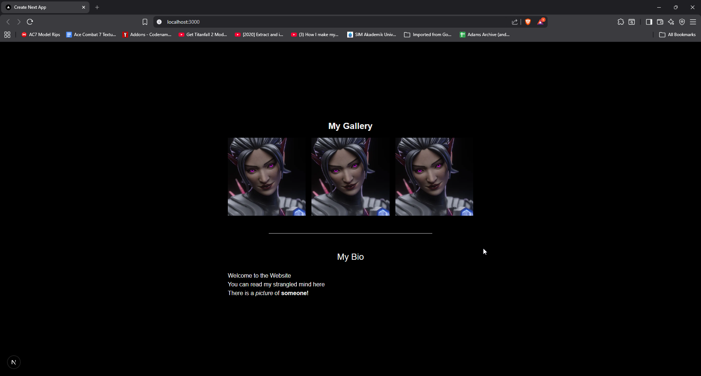

## Pelajaran
Pada soal 3 menunjukkan error pada bagian elemen "(<*p class="summary"*>)" dan hal ini juga termasuk elemen "(div)",
solusinya adalah yaitu dengan menambahkan Fragment "<>" di awal setelah "return". Adapun artibut yang salah yaitu
kata "class" yang di mana ini reserved word, solusinya yaitu mengubahnya menjadi "className=" sesuai standar DOM.
Kemudian bagian "(<*br br*>) disini juga terdapat error karena tidak ditutup, maka diubah menjadi "(<*br /br*>)"

## Laporan Praktikum - Soal 4

## Hasil dari Praktikum
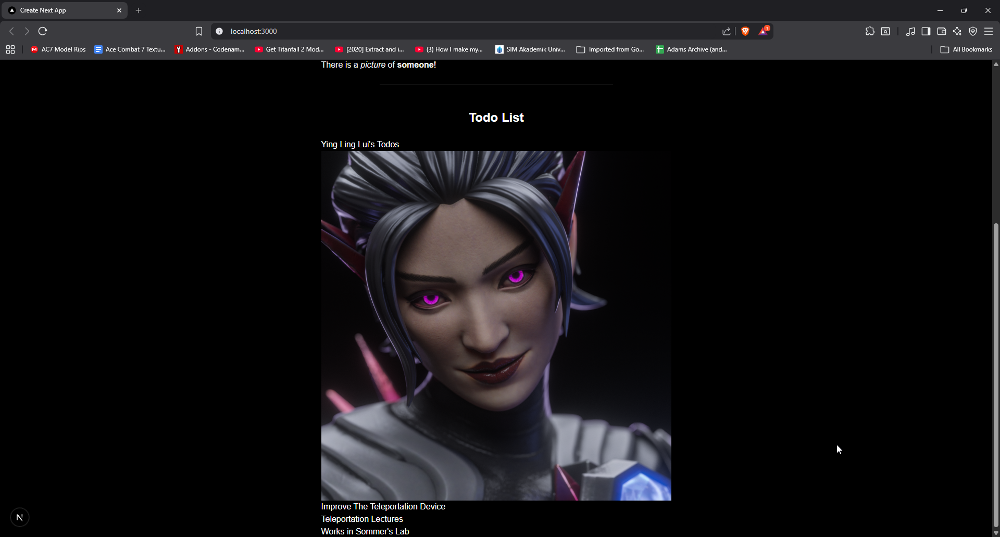
Berdasarkan soal di atas mengatakan terdapat error, error yang teridentifikasi tepat pada bari (<*h1{person}'s Todo</*h1*>)
dikarenakan variabel person didefinisikan sebagai Object JavaScript yang berisi props seperti "name" dan "theme".

Mengapa terjadi eror dikarenakan yang dibaca seharusnya adalah Objek bukan Teks, dikarenakan ({*person*}) disini adalah kumpulan data (nama, id, tema)
Jadi solusinya adalah mengubahnya menjadi (<*h1>{person.name}'s Todos</*h1>)

## Laporan Praktikum - Soal 5

## Hasil dari Paktikum
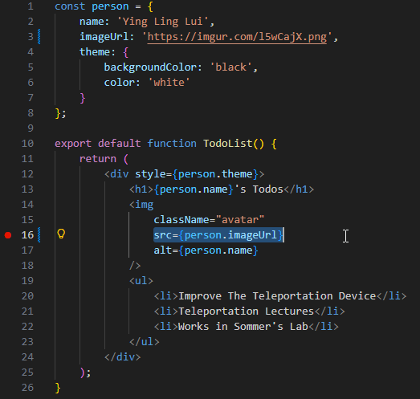

 
Dalam soal kali ini kita diminta untuk melakukan ekstrak data dengan memindahakan string URL gambar yang awalnya langsung di dalam atribut src pada tag img ke dalam objek person. 
 
Yang awalnya menggunakan, src="(link image"), kemudian dengan dirubah menjadi lebih dinamis dan rapi, src={person.imageUrl}

Mengenai perbedaan tampilan Web? 
Tidak ada yang berubah, dan tetap sama, hanya saja penulisan kode yang awalnya statis menjadi dinamis. Dan hal ini membuat kode menjadi lebih modular, jika kedepannya ingin mengganti foto tersebut maka hanya perlu mengubah nilai di dalam objek person. 

## Laporan Praktikum - Soal 6

## Hasil dari Praktikum
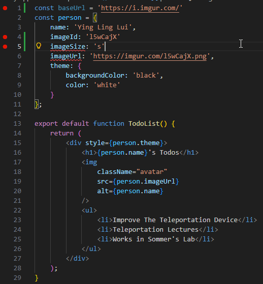
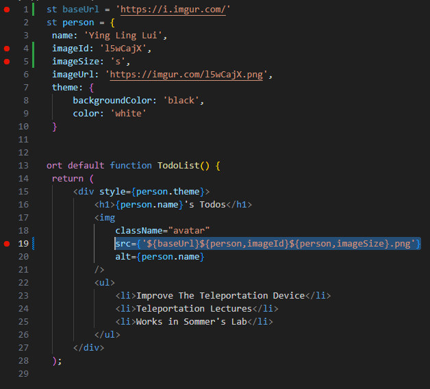
 
Dalam soal ini diminta untuk memperbaiki kode pada atribut src.
Pada base kode, di sini ditambahkan const baseUrl, dan juga penambahan dalam const person yaitu imageId dan imageSize.

Kemudian perbaikan pada bagian src="{baseUrl}{person.imageId}{person.imageSize}.jpg" , menjadi src={'${baseUrl}${person,imageId}${person,imageSize}.png'}
 
Yang di mana perbaikan tersebut dengan menggabungkan beberapa variabel JavaScript (baseUrl, imageId, imageSize) menjadi satu string URL.

## Laporan Praktikum - Soal 7

## Hasil dari Praktikum
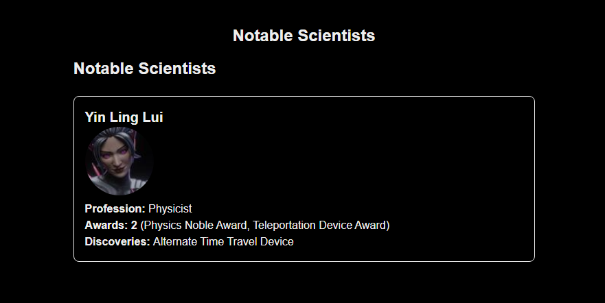
 
Soal 7 ini yang dapat dipelajari adalah bagaimana cara mentransfer informasi dari komponen lain, yaitu disini dari induk (MyGallery) ke komponen child (MyProfile)
dengan menggunakan Props, menjadi sangat efektif untuk mengurangi duplikat markup yang sama.
 
Untuk tampilan saat ini lebih terorganizir rapi dengan bounding box, dan kode yang digunakan juga lebih ringkas dan tetap lengkap.
 
Dan untuk error sendiri yang dihadapi adalah perlu mendefinisikan interface untuk props agar data yang dikirim tervalidasi dan tidak menyebabkan error "Binding Element"

## Laporan Praktikum - Soal 8
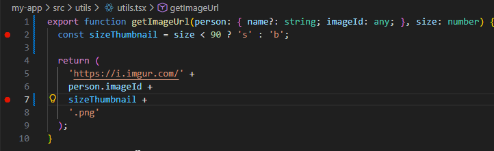
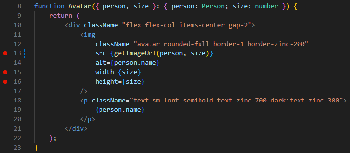
 
Pada soal 8 dapat dipelajari bagaimana cara melakukan optimasi gambar secara dinamis dengan mengirimkan parameter ukuran ke fungsi utility.
 
Maka hasilnya adalah aplikasi dapat memilih resolusi gambar yang tepat dari server berdasarkan nilai props yang diberikan, sehingga meningkatakan kualitas visual dan efisiensi performa
 
Hasilnya sebagai berikut untuk bagian Avatar, dan terdapat tambahan untuk bagian "Notable Scientists" kaitannya dengan soal 7
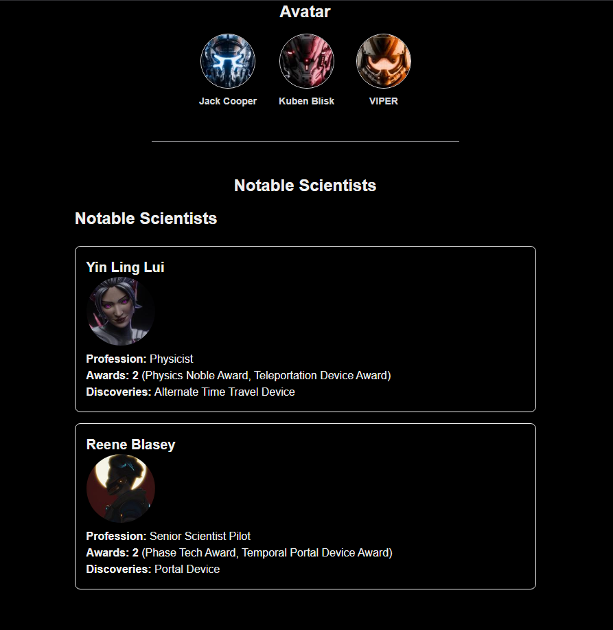
